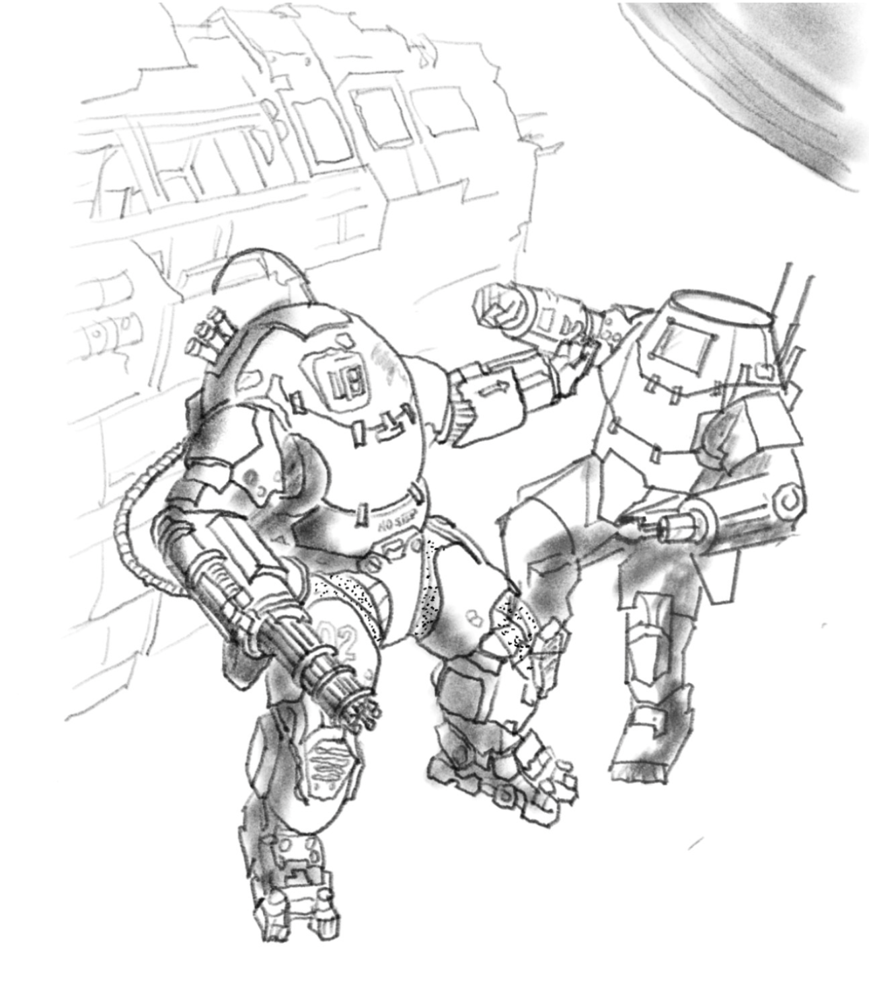

The back room of the Anodyne warehouse smelled like machine oil and Lazarus's cigarillos. It always smelled like Lazarus's cigarillos. The man went through them the way other people went through air — constantly, involuntarily, as though stopping would kill him. He sat behind a desk that had no business being called a desk, a slab of salvaged hull plating balanced on shipping crates, its surface buried under data pads, food wrappers, and a ceramic ashtray shaped like a frog. Lazarus himself was enormous, a mountain of a man whose thinning hair lay across his scalp in heroic wisps. His eyes, though — his eyes were sharp. You didn't last long as a fixer in Glimmer without sharp eyes.

Cal Simmons leaned against the doorframe, arms folded. Jakob stood behind her, stoic as a slab of concrete, which he somewhat resembled. Io perched on a crate near the back, one leg tucked under her, trying to look like she belonged in a room where people discussed things more dangerous than shuttle schedules.

"So," Lazarus said, stubbing out one cigarillo and immediately lighting another, "I've got someone for you to meet." He gestured with the fresh cigarillo toward a man sitting on the only clean chair in the room. The man looked as though he had been placed there by accident — as though he had been on his way to a conference on actuarial tables and had taken a catastrophically wrong turn. His suit was pressed. His shoes were shined. He held a data pad with both hands like a prayer book.

"This," Lazarus said, "is an insurance agent."

The man winced at the introduction but rallied. He explained, in the precise and faintly mournful tones of a man whose entire career was built on the expectation of disaster, that a ship had gone missing. A fast scout called the Yushi. On board was a courier, a Lieutenant Gary, carrying insured information of considerable value. The information was stored in implants connected to a data port in the lieutenant's arm — a fact the insurance agent communicated with visible distaste, as though the human body were an unreliable filing system.

There was a significant reward, he said. For finding the ship. For returning Lieutenant Gary — preferably alive, but otherwise at least, and here the agent paused delicately, mostly intact.

Cal glanced at Jakob. Jakob gave the faintest nod. Io was already thinking about flight paths.

"We'll take it," Cal said.

Io started working her contacts before they even left the warehouse. She'd spent years running salvage shuttles out of Glimmer, and the salvage community talked. Everyone talked in Glimmer — the whole station was one vast, buzzing hive of gossip and commerce, humming away inside the repurposed bones of the old generation ship. She put out the word: anyone seen a fast scout, registry matching the Yushi?

The answer came back fragmented, secondhand, the way information always traveled through the Forge — couriered by memory and rumor rather than any reliable signal. Someone had seen a ship matching the description. But it was under the command of a known pirate, and it had been spotted heading out of the sector.

"Heading out of the sector" was not a lot to go on. It was, in fact, almost nothing to go on. But almost nothing was more than nothing, and Io had flown on less.

She plotted a course, made her best guess at an intercept trajectory, and pushed the Night Heron hard. The old ship groaned and complained, her hull ticking as the engines ran hot. Somewhere in the aft corridor, that phantom music started up again — a faint, sourceless melody drifting through the bulkheads like a lullaby from a room that didn't exist. Benny, Io's kid brother, claimed it was ghosts. Io told him to do his homework.

Their first anchorage turned up gold. Io spotted the signs even before she ran the scans — the telltale scatter of debris, the faint thermal signatures hanging in an asteroid field like fingerprints on glass. Pirate activity. Recent.

She brought the Night Heron in slow and quiet, threading through the asteroid field with the careful patience of someone who understood that rocks the size of buildings did not care about your schedule. She parked the ship behind a nickel-iron asteroid roughly the shape of a clenched fist and cut the engines.

Two ships drifted in the field ahead. One of them was the Yushi.

The other was a pirate vessel, scarred and ugly, bristling with improvised weapon mounts. Several figures in exosuits floated around it, busy with repairs. Welding sparks popped silently in the vacuum like tiny, furious stars.

Cal studied the scene through the Night Heron's optics. "I can get aboard the Yushi," she said. "If someone gives me a ride."

Jakob grunted. This was, for Jakob, an extended speech indicating agreement.

The plan was simple in the way that plans always are before they go wrong. Jakob would pilot the exosuit — the bulky, armored rig that was technically the ship's only heavy equipment and practically Jakob's second skin — toward the Yushi. Cal would ride on the outside, sealed up in her environmental suit and light armor, clinging to the exosuit's frame. They'd approach quiet, Cal would drop off at the secondary airlock, and Jakob would peel away to draw attention if needed.

Cal sealed her suit, checked her seals twice, and grabbed hold of the exosuit's exterior frame. Jakob fired the maneuvering thrusters.

The approach started well. Then it stopped starting well.

The pirates spotted them. Maybe a sensor pinged, maybe one of the repair crew simply looked up at the wrong moment — but suddenly three exosuited figures were turning away from their welding work and reaching for weapons.

Jakob didn't hesitate. He punched the thrusters and sent the exosuit screaming past the Yushi's secondary airlock. Cal let go at the last possible moment, launching herself toward the hull in a desperate, tumbling arc. She hit the airlock housing hard, caught a handhold, and pressed herself flat against the ship's skin. The pirates' attention was on Jakob, his exosuit spiraling away from the Yushi in a blaze of thruster fire. Nobody saw her.

The airlock was another matter. Cal forced her way through the outer door, fighting the manual release mechanism in zero gravity while wearing gloves designed for grip, not finesse. Something caught, something tore — she heard the hiss before she felt it. Her suit was leaking. Not catastrophically, not yet, but the atmospheric integrity indicator on her HUD shifted from green to a queasy amber. She sealed the airlock, cycled it, and pulled herself inside.

She was aboard the Yushi. Undetected. Leaking atmosphere. Things could be worse.

Outside, things were already worse for the pirates. Jakob had attempted, briefly and optimistically, to convince the repair crew that he was a new recruit. They were not convinced. Perhaps it was the unfamiliar exosuit, or perhaps it was the fact that he had just come screaming out of an asteroid field at combat speed. In any case, they opened fire.

Jakob had been a mercenary for years. These were repair technicians with sidearms. The fight was brief and lopsided. He disabled all three of them, though his exosuit took some hits in the process — a cracked viewport seal, a stuttering left thruster. Nothing fatal. He'd fought in worse.
