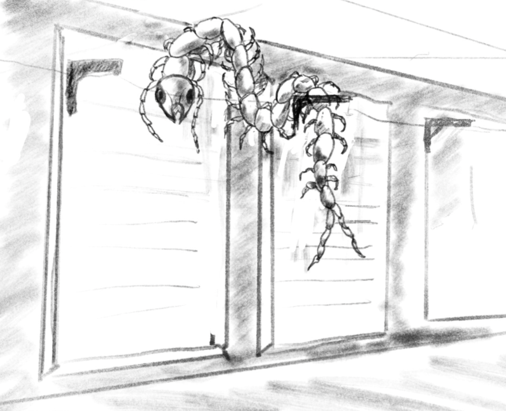

Glimmer was not, under ordinary circumstances, a welcoming place. The old generation ship had been repurposed into an orbital station with all the architectural charm of a salvage yard that had developed aspirations, and its corridors smelled permanently of recycled air, hot metal, and the particular funk of ten thousand people living in a tin can above a planet that would dissolve them on contact. But after the Yushi job, even Glimmer felt like home. They had credits in their account, a warm reception from Lazarus, and a short list of repairs that needed doing: patch Jakob's exosuit, fix Cal's armor seals, top off the Night Heron's fuel reserves. Routine maintenance. A day, maybe two.

That was the plan.

The plan lasted about six hours.

The first sign of trouble was the dockmaster, a wiry woman named Hasek who had never, in the entire time Io had known her, displayed a facial expression that could be classified as friendly. Today she was displaying one that could be classified as murderous.

"You," she said, pointing at Cal. Then at Jakob. Then at Io. "You three. You're the crew that hit those pirates in the belt."

Cal kept her expression neutral. "We recovered a missing courier for an insurance contract. Standard retrieval."

"Standard retrieval," Hasek repeated, in the tone of someone tasting something rotten. "Right. Well, your standard retrieval followed you home."

The pirates from the asteroid field, it turned out, had not taken their losses philosophically. They had tracked the Night Heron back to Glimmer, and rather than attempt a direct assault on the station—even pirates had some sense of self-preservation—they had done something considerably worse. They had seized the fuel processing facility on Styx, the scorched desert world that Glimmer orbited. The facility was old, half-ruined, and unglamorous, but it produced the fuel that kept Glimmer's station-keeping thrusters firing. Without those thrusters, Glimmer couldn't correct for orbital debris. Without corrections, debris would eventually punch holes in the station. Without a station, ten thousand people would need to find somewhere else to live, and there was nowhere else to live.

The pirates' demands were simple: they wanted compensation for their losses. They also wanted the crew of the Night Heron handed over. And until both conditions were met, no fuel would leave Styx.

Word traveled fast on Glimmer. By the time the crew made it back to Lazarus's back room, the entire station knew who had started this mess. People who had smiled at Io yesterday now looked at her the way you look at someone who has tracked something foul into your house.

"So," Lazarus said. He was not smiling. His cigarillo burned untouched between his fingers, which was how you knew things were serious. "You've got a problem."

"We didn't start this," Cal said.

"Nobody cares who started it. They care who finishes it." Lazarus leaned back in his chair, which creaked ominously. "The ship handlers won't touch the Night Heron until the fuel situation is resolved. No repairs, no resupply. Not until someone agrees to put that facility is back online."

There was a long silence. The kind of silence that has weight to it.

Cal looked at Jakob. Jakob looked at Cal. Io looked at both of them and understood, with the clarity that comes from being sixteen and having already learned that the universe is fundamentally unfair, that they were going to have to fix this.

Cal drew a slow breath. Then she placed her hand on the iron fragment she wore at her throat—a shard of old hull metal, dark and smooth from generations of handling, a relic of the Exodus ships that had carried humanity to the Forge. The ritual was older than anyone alive. Older than Glimmer. Older than the Outlands themselves.

"I swear upon the iron," Cal said. "We will restore fuel supply to Glimmer."

Jakob placed his hand on his revolver—his iron, the weapon he'd sworn his own vow upon, back when he'd learned the truth about Leonard Flint and the people he'd left behind. He said nothing. He didn't need to. The gesture was enough.

Io touched the iron pin on her collar. She thought about her mother. She thought about Benny. She thought about how swearing vows had a way of making simple problems complicated and complicated problems lethal.

She swore anyway.

Io worked her contacts one more time, pulling what intelligence she could about the facility on Styx. The results were thin. She got a location, a rough layout, some secondhand accounts from workers who'd been evacuated when the pirates moved in. But the critical question—how many armed hostiles were actually down there—remained unanswered. Could be five. Could be fifty. Nobody knew.

"We'll figure it out when we get there," Cal said, which was the kind of thing Cal said when she didn't have a better plan.

What Cal did have, unexpectedly, was money. The Yushi job had paid well, and Cal had been eyeing a piece of equipment in Glimmer's sprawling atrium market for weeks. She came back to the docking bay with a grin on her face and a brand-new surface rover on a cargo sled behind her.

It was compact, rugged, sealed against hostile atmospheres, and equipped with six independently articulated wheels designed for rough terrain. It was, by a comfortable margin, the newest and most expensive thing any of them had ever owned.

"I'm calling her Little Egret," Cal announced.

Jakob stared at the rover. "Why."

"Because I want to."

Jakob considered this. Then he helped load it into the cargo bay without further comment, which was as close to enthusiasm as Jakob ever got.

Styx was the kind of planet that made you wonder what the universe had against habitable real estate. From orbit, it was a disc of ochre and rust, baked under the savage blue light of Acheros. The atmosphere was corrosive. The surface was a wasteland of sunblasted rock, wind-scoured plateaus, and grottoes flooded with acid. Traces of extinct life lay everywhere—fossilized shapes in the stone, the ghosts of ecosystems that had flourished and died long before humanity stumbled into the Forge. Whatever had lived here had looked at the conditions and, sensibly, given up.

Io had never made a planetary landing before. She had flown shuttles in and out of Glimmer's docking bays a thousand times, threaded asteroid fields, outrun pirates. But she had never punched through an atmosphere, never fought gravity and wind and the sickening pull of a planet that wanted very much to drag her ship into its surface at terminal velocity.

She brought the Night Heron in clean. The old ship bucked and shuddered as the corrosive atmosphere clawed at her hull, the viewports flaring with ionization, but Io held the descent steady, adjusting pitch and yaw with the calm, instinctive precision that made people forget she was sixteen. The landing struts hit dirt with a solid thump, and the Night Heron settled onto the surface of Styx as though she'd been doing it her whole life.

"Nice," Cal said, from the copilot's seat.

“Piece of cake,” said Io, sitting on her hands so Cal couldn’t see them shaking.

They had set down in a shallow valley, far enough from the fuel facility to avoid detection but close enough that the rover could cover the distance. When they cracked the cargo ramp and rolled Little Egret out onto Styx, the landscape that greeted them was deeply wrong. A greenish light filtered through the haze, diffused by the corrosive atmosphere into something that looked less like daylight and more like the glow inside a bruise. Acid mud geysers punctuated the terrain, burping plumes of caustic vapor at irregular intervals. The ground was hard, crusted, the color of old rust. And running alongside their landing site, improbably, was a road.

Not a natural formation. A road. Cracked and ancient, half-buried by windblown sediment, but unmistakably engineered.

"Where does it go?" Io asked.

"One direction goes to the facility," Cal said, checking her nav. "The other direction—no idea."

"Facility first," Jakob said. "Mysteries later."

They left Benny aboard the Night Heron with strict instructions: do not touch anything, do not open the hatch for anyone, and if someone tries to force their way in, seal the bridge and call on the comms. Benny, sitting cross-legged in the pilot's seat with his game controller already in his hands, nodded solemnly. He was twelve. He understood the gravity of the situation. He also understood that with the ship to himself, he could play his game at full volume without Io telling him to use headphones.

Io drove. She drove the way she flew—fast, precise, with a controlled aggression that suggested the terrain was a problem to be solved rather than a hazard to be respected. Little Egret bounced and jolted over the cracked hardpan, her six wheels chewing through patches of chemical crust, while the crew watched the landscape scroll past through the rover's sealed viewports. Geysers hissed in the middle distance. The greenish light turned everything the color of old copper.

They were close to the facility when the riverbed caught them. It was dry, or at least it contained no liquid at the moment, but the channel it had carved through the rock was deep and steep-sided, and Little Egret's wheels spun uselessly on the smooth, acid-polished stone. Io tried three different approaches, reversed, tried again. The rover settled deeper into the channel and stopped.

"We walk from here," Cal said.

They climbed out into the corrosive air, their sealed suits hissing as atmospheric scrubbers kicked into high gear. The facility loomed ahead of them—a sprawling industrial complex built into the side of a rocky bluff. It was old. Far older than its current use would suggest. The architecture was massive, utilitarian, designed by people or things that had built to last and largely succeeded, though time and acid had taken their toll. Whole sections lay in ruin, walls dissolved to skeletal frameworks, roofs collapsed into piles of corroded rubble. The parts that still functioned had been patched and re-patched with newer materials, giving the place the look of an old coat that had been mended so many times that none of the original fabric remained.

Cal went ahead, moving low and quiet, keeping to the shadows of the ruined sections. She was good at this. Infiltration was her craft, the skill she'd honed through years of petty crime and hard lessons, and she moved through the wreckage like smoke. When she came back, she was smiling.

"Loading dock," she said. "East side. Completely disused. Door's half off its track."

"Why disused?" Jakob asked, because Jakob's instinct for trouble was nearly as reliable as his aim.

"We'll find out."

They found out.

Inside, the facility was a labyrinth of corridors and processing chambers, most of them dark, all of them smelling of chemical residue and ancient decay. Io found an evacuation map on a wall near the loading dock—faded, cracked, but legible. She traced the route to the control room with her finger.

"Here," she said. "Two levels up, west wing."

"What's between us and there?"

Io studied the map. Then she looked at the corridor ahead, where the floor simply ended.

The acid sinkhole had opened sometime after the map was printed. It was enormous—a yawning pit where the floor of a large processing chamber had collapsed into some underground cavity, leaving a drop of perhaps twenty meters into a bubbling, steaming lake of acid that glowed faintly in the dim light. The air above it shimmered with caustic vapor. The only way across was a maintenance catwalk that spanned the gap, a narrow metal grating suspended on corroded supports.

The catwalk had seen better days. It had also seen better centuries. Acid fumes had eaten into the metal until it looked less like structural steel and more like lace. Several of the support struts were visibly thinned. One was missing entirely.

"That's why the loading dock was disused," Cal said.

The three of them stood at the edge of the sinkhole and stared at the catwalk. Below, the acid lake popped and seethed, sending up lazy bubbles that burst with faint, hissing sighs.

"I've got a grapple," Io said, digging through her gear bag. She produced a compact grappling hook with a length of high-tensile line. She swung the hook across the span, lodging it in a support beam on the far side, and pulled the line taut. A safety line. Better than nothing. Marginally.

Io went first. She was light, quick, and possessed of the particular fearlessness that comes from being young enough to believe, on some fundamental level, that bad things happen to other people. She crossed the catwalk at a near-jog, one hand on the safety line, her feet finding the solid sections of grating with instinctive accuracy. She reached the far side and turned back, breathing easily.

Cal went next. She was slower, more deliberate. She kept her eyes fixed on the far wall, on Io's face, on anything that was not the bubbling hellscape below. The catwalk groaned under her weight. A section of grating flexed ominously. She did not look down. She reached the far side and let out a breath she hadn't realized she'd been holding.

Then Jakob.

Jakob was not light. Jakob was six feet tall and two hundred and twenty pounds of muscle, scar tissue, and bad experiences. He was also, as it turned out, afraid of acid. This was not an irrational fear. It was, given the circumstances, perhaps the most rational fear a person could have. But rationality did not help when the catwalk shuddered under his boots and he made the mistake of looking down.

The acid lake bubbled. It seemed to be looking back.

Jakob's foot slipped. His hand missed the safety line. For one terrible moment he was falling, his weight hitting the corroded grating at an angle, and then the grating gave way beneath him and he was dangling, one hand clamped on a support strut, his legs swinging over twenty meters of nothing above a lake that would dissolve him to the bone.

The grappling hook shifted. The anchor point, weakened by acid, began to pull free. If it went, the safety line went. If the safety line went, their only way to retrieve Jakob went with it.

Io lunged. She threw herself flat on the far platform, reaching for the grappling hook with both hands. The metal groaned; the hook shifted another centimeter. She grabbed it and hauled it sideways, jamming it into a seam in the beam where the metal was thicker, more solid. It held.

At the same moment, Cal unclipped her own grapple from her belt, swung it, and snagged Jakob's equipment harness. The line snapped taut. Between the two anchors—Io's repositioned hook and Cal's line—Jakob hung suspended.

He looked up at them. He looked down at the acid. He began to climb.

The line was thin. It bit into his palms, sliding through fingers still tender from the electrical burns he'd taken aboard the Yushi. He climbed anyway, hand over hand, his boots scrabbling against the remaining fragments of catwalk, his jaw set in the expression of a man who has decided, with absolute finality, that he is not going to die in a hole on a planet called Styx.

He reached the platform. Cal hauled him over the edge. For a long moment the three of them sat there, breathing hard, not speaking. Below, the acid lake bubbled on, indifferent to their survival.

"I hate this planet," Jakob said.

Nobody disagreed.

They found the control room on the second level of the west wing, behind a heavy hatch that looked like it had been designed to survive a war. Io found a small external monitoring screen—an auxiliary security feed, probably installed by the facility's previous operators—and tapped into it.

One man. One pirate, slumped in the control chair, surrounded by a litter of food wrappers and empty drink containers. He had a sidearm on his hip and a carbine propped against the console beside him. His head was tilted back. His mouth was open.

He was asleep.

Cal looked at the screen. She looked at the hatch. She smiled the way a cat smiles at an open birdcage.

She found the manual release, eased the hatch open one agonizing centimeter at a time, and slid through the gap like water through a crack. The control room was warm, humming with the low drone of processing equipment. The pirate's breathing was deep and even. Cal crossed the room in four silent steps, positioned herself behind the chair, and struck.

She seized the man by the neck with one hand and grabbed for his gun arm with the other. The pirate came awake instantly—not the slow, groggy surfacing of deep sleep but the explosive, adrenaline-soaked snap of a man who slept in dangerous places. He twisted in her grip, wrenching his arm free. His hand found the sidearm. He was pulling it from the holster, turning it, the barrel swinging toward Cal's midsection—

The hatch burst open. Jakob filled the doorway like a wall with legs, crossed the room in two strides, and brought the butt of his revolver down on the man's skull with a sound like a melon hitting pavement. The pirate went limp. The gun clattered to the floor.

"Thanks," Cal said.

"Yep," Jakob said.

They bound the man's wrists and ankles with cable ties, propped him in the chair, and waited for him to rejoin the conversation. It didn't take long. He came around with a groan, blinked at the three figures standing over him, and adopted the defiant sneer of a man who has realized he is in serious trouble and has decided to be difficult about it.

Jakob leaned close. He was very good at leaning close. At six feet and two hundred twenty pounds, with the scar on his head and the medical port on his arm and the heavy revolver resting casually in his hand, Jakob could make leaning close feel like a geological event.

"How many of you are there," Jakob said. It was not a question.

The pirate laughed. It was not a brave laugh—it was the laugh of a man performing bravery, projecting it outward like a shield. He spat in Jakob's face.

Jakob wiped his cheek. His expression did not change. This was, in its way, more frightening than if he had reacted with anger.

"Let me," Cal said, stepping forward.

Cal did not lean. Cal did not threaten. Cal sat on the edge of the console, crossed her legs, and began to lie. She lied beautifully, fluently, with the easy conviction of someone who had grown up lying to survive. She told the pirate things that weren't true about reinforcements, about deals, about what would happen to people who cooperated versus people who didn't. She wove a story so plausible and so specifically terrifying that the pirate's sneer began to crack around the edges.

He broke. Not all at once—pride has its own momentum—but in pieces. Four more, he said. Four other pirates in the facility. He offered this information grudgingly, as though each word cost him something.

Then his expression changed. The sneer came back, but different now. Nastier. More genuine.

"Doesn't matter," he said. "Your ship. The one you parked in the valley." He grinned. "We've been tracking it since you entered atmosphere. My friends know exactly where it is." He laughed—a high, cracked sound, the laugh of a man who knows he's lost but wants to make sure you lose too. "Hope you didn't leave anyone on board."

The laughter stopped. Jakob's revolver barked once, a flat, final sound in the close confines of the control room. The pirate slumped in the chair.

The echo faded. The processing equipment hummed. Somewhere in the facility, a pipe dripped acid onto stone.

Cal, Jakob, and Io looked at each other. The same word rose in all three of them, but it was Io who said it, Io whose voice cracked on the single syllable, Io who was already moving toward the door.

"Benny

Io was already at the comm panel, fingers flying. The channel crackled and then Benny’s voice came through, slightly breathless, tinny with distance.

“Hey. Everything okay up there?”

“Fine,” Io said. “Hey, remember when we tried to sneak back onto mom’s ship after curfew and she’d changed the code on the air handlers?”

A beat of silence. Then: “Yeah.”

“Watch the air handlers.”

Another beat. Longer this time. When Benny spoke again, the breathlessness was gone, replaced by something quieter and more careful. “Got it,” he said.

Io clicked off. She stood for a moment with her hand on the panel and didn’t let herself think about what would happen if it wasn’t a bluff.

Cal was already at the control room’s monitoring station, pulling up the internal camera feeds with the focused efficiency of someone who had grown up understanding that information was the only currency that never lost its value. The facility’s surveillance system was old, patchy, and half-blind in several sections; she worked around its gaps the way a sailor works around rocks, mapping absence as carefully as presence. She handed off what she had to Io, who pulled the threads together into something like a picture.

Four pirates. The threat to the Night Heron might have been nothing more than a last, spiteful bluff—there was no movement near the valley on any camera that still functioned. In a room near the facility’s old crew quarters, seven workers sat huddled under the eye of a single armed guard. Two more pirates were working their way through the private quarters on the upper level, unhurried, loading personal effects into bags with the professional detachment of people who had done this before. And in the galley, one pirate sat alone at a table, eating what appeared to be some kind of layered cake with a fork and the expression of a man who had found the one good thing about this assignment.

“Tiramisu,” Cal said, peering at the screen.

“Focus,” said Jakob.

The plan, such as it was, was simple. The guard was their first priority; the prisoners were behind him, and the other three pirates were separated and distracted. They would hit the guard hard and fast, free the workers, and deal with the rest.

Before they left the control room, Io paused by the body of the pirate Jakob had shot. She looked at the sidearm still gripped in his dead hand. She paused for a long moment; then she took it. She had never fired a gun in her life. She didn’t entirely know why she was taking it now. It was heavy in her hand, heavier than she expected, and she tucked it into her belt and followed the others out.

The corridor leading to the prisoners was long and dim, lit by emergency strips that cast everything in shades of amber and shadow. They rounded the corner, and there was the guard—a broad-shouldered man leaning against the wall beside a closed door, arms folded, looking bored.

Jakob didn’t draw his weapon. He just walked toward the pirate.

There was something in the way Jakob walked implacably toward problems that tended to communicate things words couldn’t. He was a large man with a scarred head and the unhurried gait of someone who had never once in his life needed to run, and he crossed the corridor toward the guard with the energy of an approaching weather system.

Then something erupted from behind the guard’s legs.

It was the size of a large dog, roughly, but the resemblance to anything familiar ended there. It moved in a rippling, undulating surge across the floor, dozens of legs working in coordinated waves beneath a segmented body—a creature that looked, improbably and disturbingly, like a giant caterpillar. It made no sound. It simply came, fast and purposeful, straight at them.

Cal fired. The shot spanged off the ceiling, and the creature did not so much as flinch. It had no visible ears, or possibly it had other priorities.

Io dove left. Her hand found the stolen sidearm without thinking, and she brought it up in both hands the way she’d seen people do it and fired. She had no idea what she was doing. The shot went wide, cracking into the wall somewhere to the creature’s right, and the muzzle kick nearly took the gun out of her hands—but the creature stopped. It turned. Something in its sensory apparatus, whatever it used instead of ears, had registered the shot, and for one suspended moment it paused, recalibrating.

Jakob’s revolver came up. The report was enormous in the enclosed corridor. The creature dissolved from the inside out, collapsing into a spreading pool of green ichor that immediately began to bubble against the floor plating, eating into it with a faint, purposeful hiss.

The guard, who had flattened himself against the wall during all of this, was staring. Jakob turned to look at him. Jakob was still holding the revolver. The ichor was still hissing. The guard’s own weapon hung loose in his hand at his side.

“Don’t make me put you down too,” Jakob said.

The guard dropped his weapon. His other hand, Io noticed, was moving toward his belt—toward a small comm unit clipped there. He got to it; they were not quite fast enough to stop him. The signal went out in the second before Cal pinned his arm.

But the door opened, and seven people came out blinking into the corridor, and for a moment that was enough.

The remaining three pirates, it seemed, had been listening. The freed workers had barely finished their first ragged expressions of relief when the sounds of rapid movement filtered through the facility—boots on metal stairs, a door banging open somewhere above them, the distant whine of an engine. By the time Cal made it to a window, she caught only a glimpse of a vehicle—one of their own, apparently—disappearing over the ridge to the north.

No one went after them. The facility was secured; the math was what it was.

What they found in the aftermath of the guard’s surrender was worse than another fight would have been. One of the workers—a man whose name, they learned from the others, was Demas, and who had apparently made the facility’s galley feel like somewhere worth eating for the past eleven years—had a wound on his forearm from the creature’s mandibles. The ichor was in it. They did everything they could think to do, and some things they weren’t sure about, with the medical kit from Little Egret and the facility’s own sparse supplies. Demas was conscious for a while. He talked about someone on Glimmer. Then he wasn’t conscious anymore, and then, quietly, he was gone.

The Night Heron was intact. The air handlers had not been touched. Benny, when they returned to the ship, was sitting in the pilot’s seat with his game controller in his lap and the careful, studied nonchalance of someone who had been frightened and was pretending he hadn’t been. Io didn’t say anything about it. She just put her hand briefly on the top of his head, the way their mother used to, and went to begin pre-launch.

They brought Demas back to Glimmer. It was the right thing to do, and it was also the hardest part of coming back. He had been popular on Glimmer, the way quietly indispensable people always are—noticed most in his absence, mourned by more people than any of them had expected. Some of those people still looked at the crew of the Night Heron the way you look at something you haven’t decided how to feel about yet.

The fuel situation was resolved. The ship handlers were as good as their word: the Night Heron was fueled, and Cal’s armor seals were patched, and Jakob’s exosuit went into the repair bay and came out whole. A promise made on Glimmer held, even when the people making it were grieving.

It wasn’t the ending any of them had wanted. But in the Forge, most endings weren’t. You swore your vows, you kept them as best you could, and you carried what you couldn’t fix.

The Night Heron rested in Glimmer’s docking bay. Somewhere in the aft corridor, faint and sourceless, the phantom music played.
